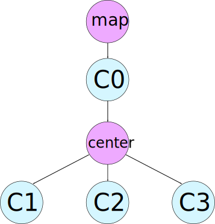

Architecture
============

.. _frames_section:

Frames
------

This section describes the different coordinate systems used. There are two special marker, ``map`` and ``center``. ``map`` is the origin of the global frame (0,0), ``center`` has the property to be seen by all cameras. Every camera has its own frame, as do the ``center`` and ``map``.

The coordinate systems (frames) used can be seen in this illustration. The four cameras are depicted by C0 to C3 and are connected via the center marker. C0 can see the marker which represents the origin. When a marker is now seen in C1, C2 or C3, the position in the ``map`` frame can be computed by going ``C0->center->map`` . The arrow have to be read like ``a->b`` means ``a is parent of b``. 

For dealing with the different coordinate systems, `tf2`_ is used, the de facto standard transform library for ROS. In the current setup, ``map`` and ``center`` have to be seen at all time. If they are moved, then the coordinate system changes because the relation between them changes. But as long as they adhere to their position requirements, the package runs. As the transformations obtained by ArUco are from camera to marker, some have to be inversed to get the above graph.

Cameras
-------

We use four ceiling mounted Logitech USB cameras. They are interfaced with the `usb_cam`_ package and launched by a custom launch file **launch/usb_cam_by_id.xml** . They have to have overlapping field of view, at least one marker, the ``center``, has to be seen by all four cameras. For accurate results, the cameras have to be calibrated.

Right now, the cameras are not mounted to a fixed device address, i.e. camera IDs can change when restarting the computer. Therefore, make sure that *usb_cam0* is the one which can see the origin marker.

Marker
------

The marker used are from ArUco and detected by vanilla `ar_sys`_. We use a slightly changed multi_board version launch file (see *launch/aruco_multi.xml*). The list of boards which can be detected is in **config/boards.yml**. The origin and center marker **HAVE** to be called ``map`` and ``center`` respectively. Other marker have to be prefixed *marker*. Each board consists of two configuration files: one in pixel and one in meter. We only need the later. These can be found in *config/boards* and can be generated. To add a new board, either do the way of ArUco and use the command line tools directly or use the scripts in this package. More on that in :doc:`scripts`.

.. figure:: images/marker_344.png
    :align: center

    A typical ArUco marker. Each marker encodes a number.

A good overview on ArUco marker can be found in this `OpenCV ArUco`_ tutorial or directly on the `authors homepage`_.

Nodes
-----

The following section describes which nodes the *panopticon* package uses to get the marker positions.

usb_cam
^^^^^^^

We have one ``usb_cam`` node for every camera used. These publish the raw image on ``/usb_cam$(camera_id)/transform``. They are started with the ``usb_cam_by_id`` launchfile.

ar_sys
^^^^^^

We have one ``ar_sys`` multi-board node for every camera. These publish the transformation from camera to marker for each detected marker on ``cam$(camera_id)/transform``. These are started with the ``aruco_multi`` launchfile.

panopticon_transformer
^^^^^^^^^^^^^^^^^^^^^^

This node takes the transformations from the four ``ar_sys`` nodes and creates the transformation graph depicted in :ref:`frames_section` . That is done by filtering markers and inversing some of the transformations. Marker filtering is necessary, as tf only allows one parent, but a marker can be seen potentially in four cameras, so could have four parents.

panopticon_poser
^^^^^^^^^^^^^^^^

This node takes the transformations for vanilla markers (not center or map) from the four ``ar_sys`` nodes, computes the pose in the world frame and publishes them. As every marker can potentially be seen by four cameras, each marker used has four accompanying topics.

Subscribed topics
-----------------

The following section lists the topics subscribed and published. These are only the topics of this very package. Topics from ``ar_sys`` and ``usb_cam`` are omitted, see their respective documentations.

``camera0/transform`` (geometry_msgs/TransformStamped)
	The transform from the first camera to each detected marker.
``camera1/transform`` (geometry_msgs/TransformStamped)
	The transform from the second camera to each detected marker.
``camera2/transform`` (geometry_msgs/TransformStamped)
	The transform from the third camera to each detected marker.
``camera3/transform`` (geometry_msgs/TransformStamped)
	The transform from the fourth camera to each detected marker.

Published topics
----------------

For every marker listed in the board configuration file that is also detected, panopticon publishes the raw position in world coordinate for every camera. As every marker can potentially be seen by four cameras, each marker used has four accompanying topics.

``pose/marker$(markerId)/cam0`` (geometry_msgs/PoseWithCovarianceStamped)
	The pose of marker *$(markerId)* detected by cam0 in world coordinates.
``pose/marker$(markerId)/cam1`` (geometry_msgs/PoseWithCovarianceStamped)
	The pose of marker *$(markerId)* detected by cam1 in world coordinates.
``pose/marker$(markerId)/cam2`` (geometry_msgs/PoseWithCovarianceStamped)
	The pose of marker *$(markerId)* detected by cam2 in world coordinates.
``pose/marker$(markerId)/cam3`` (geometry_msgs/PoseWithCovarianceStamped)
	The pose of marker *$(markerId)* detected by cam3 in world coordinates.

.. _tf2: http://wiki.ros.org/tf2
.. _usb_cam: http://wiki.ros.org/usb_cam
.. _ar_sys: http://wiki.ros.org/ar_sys
.. _OpenCV ArUco: http://docs.opencv.org/3.1.0/d5/dae/tutorial_aruco_detection.html#gsc.tab=0
.. _authors homepage: http://www.uco.es/investiga/grupos/ava/node/26