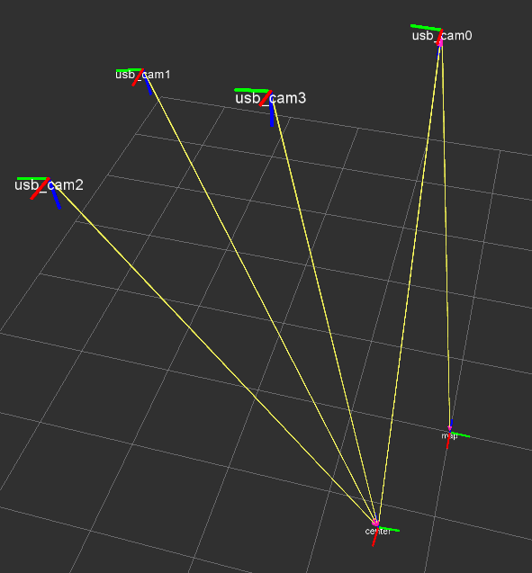

Welcome to panopticon's documentation!
======================================

This ROS package is used to localize robots by putting markers on their top. The infrastructure in which it will be used has four ceiling cameras with overlapping field of views. Panopticon detects the robots and gives their position in a global world frame. The source code can be obtained `on Github <https://github.com/Rentier/ros-panopticon>`_ . 

Contents:

.. toctree::
   :maxdepth: 2

   arch
   installing
   usage
   scripts
   todo

	Overview of the camera and frame setup. The four ceiling cameras can see a center marker. One camera can see the marker that serves as the origin. The position of any marker seen by atleast one camera can be transformed into the world frame.

